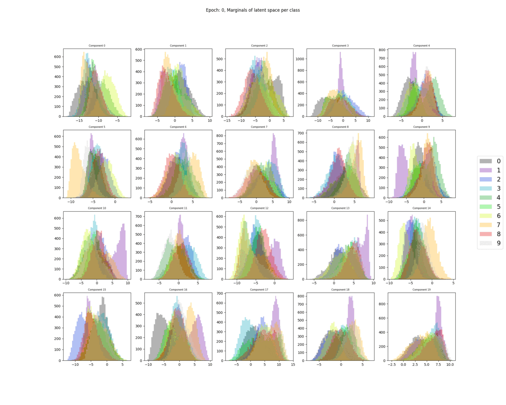
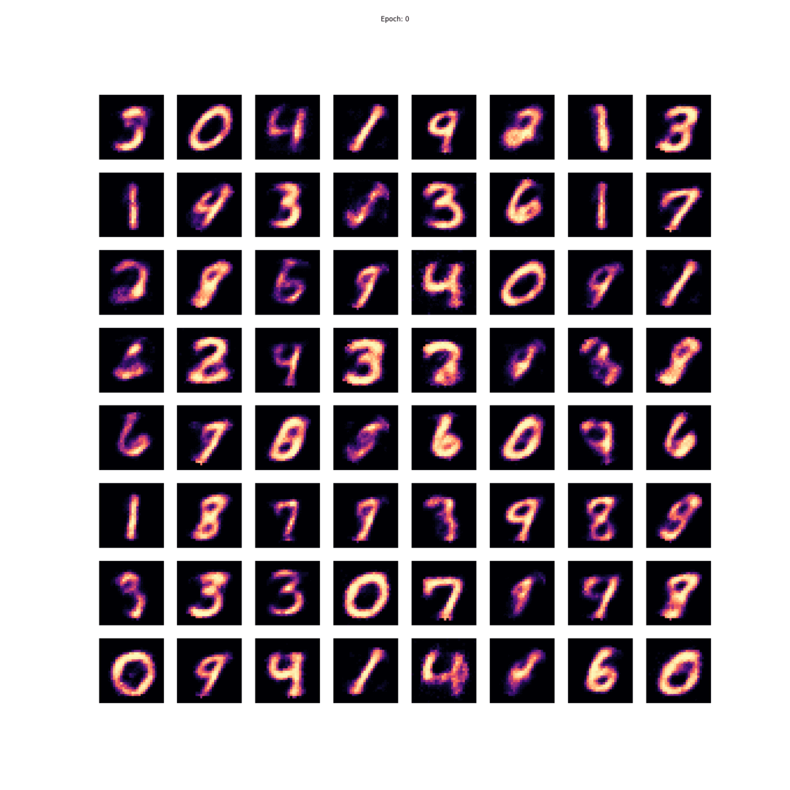

# Variational Autoencoders

... are a nice approach to generative modeling.

With this code one may train a basic VAE on MNIST / CIFAR-10.

Also some utilities are included to visualize the distributions of the latent space.

